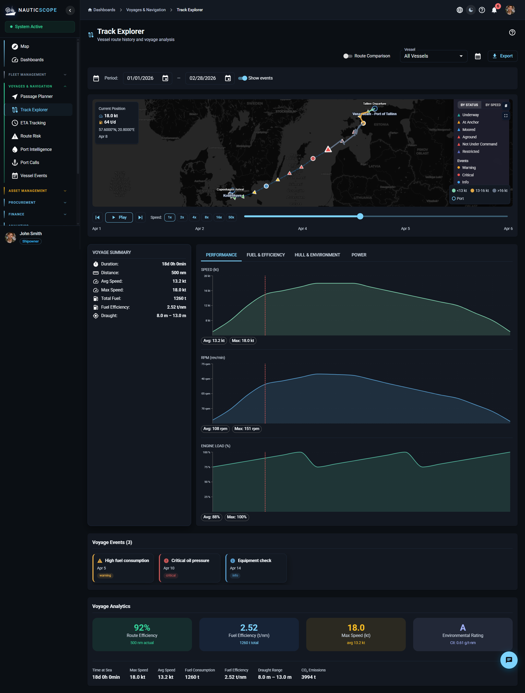
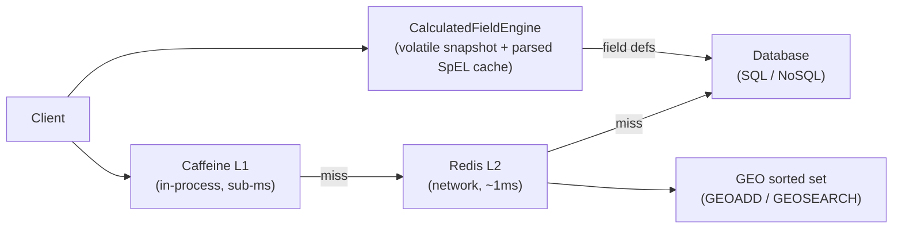

# cacheforge – Multi-Tier Caching with Redis Lua & Caffeine

A Kotlin/Spring Boot module implementing production caching patterns: atomic Redis Lua scripting for geo-spatial index updates, L1/L2 cache hierarchy with Caffeine and Redis, GPS outlier filtering using the Haversine formula, a SpEL-based expression engine with parsed-expression caching, and Lua-based compare-and-set for alert state deduplication.



## Architecture



**Key flows:**

- **GeoIndexService** – executes a Lua script that atomically checks the existing `timestamp_epoch` before calling `GEOADD` + `HSET`. Returns a typed `GeoUpdateResult` (Updated / StaleRejected / InvalidCoordinates / Failed). Validates lat/lon before sending to Redis. GEO and meta keys share a single configurable TTL.
- **GeoQueryService** – `GEOSEARCH BYBOX` or `BYRADIUS` with `includeDistance()`, then a single Lua batch-metadata fetch (one Redis call). Returns `EntityPositionResult` with `distanceKm` from GEOSEARCH. Source filtering is applied post-fetch.
- **GpsOutlierFilter** – L1 = Caffeine (configurable size/TTL), L2 = Redis HASH (TTL refreshed on every write). Rejects GPS points implying speed above a configurable threshold via Haversine. Applies a minimum comparable interval to avoid unreliable speed calculations on sub-second deltas. Validates coordinates before storage.
- **CalculatedFieldEngine** – a single `@Volatile` `FieldSnapshot` object holds field definitions, tag-to-field index, and pre-parsed `Expression` instances. Reloads are atomic single-reference swaps. Expressions are validated at load time (parse + dry-run evaluation) - invalid expressions are skipped and reported in `ReloadResult`. Uses `SimpleEvaluationContext` (read-only, no type access) to prevent SpEL injection.
- **AlertStateCache** – Lua compare-and-set: `updateIfNewer()` atomically reads existing state, compares `timestampEpoch`, and writes only if the incoming timestamp is equal or newer. Returns typed `AlertStateUpdateResult` (Updated / StaleRejected / Failed). `getState()` returns `AlertStateLookup` (Found / Missing / Failed) to distinguish cache miss from storage failure.

## Configuration

All tunables are centralized in `CacheForgeProperties` via `@ConfigurationProperties(prefix = "cacheforge")`:

```yaml
cacheforge:
  geo:
    geo-key: "cacheforge:entity:positions:geo"
    meta-key-prefix: "cacheforge:entity:positions:meta:"
    position-ttl: 24h
  alerts:
    state-key-prefix: "cacheforge:alert:state"
    state-ttl: 24h
  filter:
    outlier-speed-threshold-knots: 50.0
    min-comparable-interval-seconds: 2
    cache-max-entries: 500
    cache-ttl: 1h
    redis-key: "cacheforge:gps-filter:last-positions"
    redis-key-ttl: 7d
```

All values have sensible defaults - zero-config startup works out of the box.

## Tech Stack

| Layer | Technology |
|---|---|
| Language | Kotlin 1.9 / JVM 21 |
| Framework | Spring Boot 3.2, WebFlux |
| In-process cache | Caffeine 3.x |
| Distributed cache | Redis (Reactive, Lua scripting) |
| Expression engine | Spring SpEL |
| Async | Kotlin Coroutines + kotlinx-coroutines-reactor |
| Logging | kotlin-logging (oshai) |
| Testing | JUnit 5, MockK, kotlinx-coroutines-test |

## Project Structure

```
src/main/kotlin/com/cacheforge/
  config/
    CacheConfig.kt               – Spring beans, @EnableConfigurationProperties
    CacheForgeProperties.kt      – centralized @ConfigurationProperties
  geo/
    GeoIndexService.kt           – interface: atomic position update → GeoUpdateResult
    GeoIndexServiceImpl.kt       – Redis Lua: timestamp-gated GEOADD + HSET
    GeoQueryService.kt           – interface: spatial queries
    GeoQueryServiceImpl.kt       – GEOSEARCH + batch Lua metadata fetch
    GeoModels.kt                 – EntityPositionResult (with distanceKm), GeoStats
    GeoUpdateResult.kt           – sealed: Updated / StaleRejected / InvalidCoordinates / Failed
  filter/
    GpsOutlierFilter.kt          – interface + LastPosition nested class
    GpsOutlierFilterImpl.kt      – Caffeine L1 + Redis L2 hybrid, Haversine
  expression/
    CalculatedFieldEngine.kt     – interface: SpEL evaluation → ReloadResult
    CalculatedFieldEngineImpl.kt – atomic snapshot swap, expression validation
    CalculatedFieldRepository.kt – pluggable field source interface
    ExpressionModels.kt          – CalculatedFieldDefinition (with init validation), ComputedFieldResult
    DataSourceType.kt            – enum: CALCULATED, REAL, DEMO, UNKNOWN
    ReloadResult.kt              – loaded/skipped counts + invalid expression names
  state/
    AlertStateCache.kt           – interface: getState → AlertStateLookup, updateIfNewer
    AlertStateCacheImpl.kt       – Lua CAS dedup (compare-and-set by timestamp)
    AlertStateLookup.kt          – sealed: Found / Missing / Failed + AlertStateUpdateResult
```

## How to Build

```bash
./gradlew build
./gradlew test
```

Requires Java 21 and a running Redis instance (or use `spring.data.redis.host` / `spring.data.redis.port` env vars). The `GpsOutlierFilter` degrades gracefully to in-memory-only mode when Redis is unavailable.

## Lua Scripts

### Timestamp-gated position update

The `GeoIndexServiceImpl` uses a Lua script to guarantee atomicity:

```lua
local existing_ts = redis.call('HGET', KEYS[2], 'timestamp_epoch')
if existing_ts == false or tonumber(ARGV[7]) >= tonumber(existing_ts) then
    redis.call('GEOADD', KEYS[1], ARGV[1], ARGV[2], ARGV[3])
    redis.call('HSET', KEYS[2], 'lat', ARGV[4], ...)
    return 1
end
return 0
```

Without Lua, a check-then-set sequence has a race window where two concurrent updates with different timestamps could both read "no existing entry" and both write - the older one winning if it executes second.

### Batch metadata enrichment

After `GEOSEARCH` returns entity IDs, a single Lua call fetches all metadata hashes and returns them as JSON via `cjson.encode`, eliminating the N+1 access pattern.

### Alert state compare-and-set

The `AlertStateCacheImpl` uses a Lua CAS script: reads existing state, compares `timestampEpoch`, writes only if the incoming timestamp is equal or newer. This prevents stale overwrites from concurrent events.

## Haversine Distance

The GPS outlier filter uses the Haversine formula to compute great-circle distance between two GPS coordinates:

```
a = sin²(Δlat/2) + cos(lat1) × cos(lat2) × sin²(Δlon/2)
distance = 2R × arcsin(√a)
```

Speed is then derived as `distance_km / time_hours × 0.539957` (km/h to knots). Points implying speed above the configured threshold (default 50 knots) are rejected. Intervals shorter than `minComparableIntervalSeconds` (default 2s) return 0.0 to avoid GPS jitter amplification.

## SpEL Variable Mapping

Tag codes use dot notation (e.g., `fuel.consumption`). SpEL variable names cannot contain dots, so the engine replaces `.` with `_` before setting context variables:

```kotlin
val variableName = tag.replace('.', '_')
context.setVariable(variableName, value)
```

The expression `#fuel_consumption / #speed_knots` maps to input tags `["fuel.consumption", "speed.knots"]`.

## Known Trade-offs

- **Source filtering is post-fetch.** `GeoQueryService` applies `sources` filter after GEOSEARCH + enrichment, so the returned count may be less than the requested `count`. This is by design - Redis GEO does not support per-member attribute filtering natively.
- **`windowMinutes` is modeled but not evaluated.** `CalculatedFieldDefinition` accepts `windowMinutes` for future windowed aggregation support. Fields with `windowMinutes` set are silently skipped during evaluation.
- **Silent degradation on Redis failures.** All Redis operations degrade gracefully (return empty/zero/Failed) rather than propagating exceptions. This keeps the pipeline alive but means data may be silently missing. Typed result types (`GeoUpdateResult`, `AlertStateLookup`, `AlertStateUpdateResult`) make the failure mode explicit to callers.
- **Single global GEO key.** All entities share one GEO sorted set. This simplifies queries but means a single key holds all position data. For multi-tenant deployments, the key prefix should be parameterized.
- **No cleanup job for stale GEO members.** GEO and meta share the same TTL, but if Redis evicts individual meta keys under memory pressure, the GEO member remains. Queries silently skip members with missing metadata.

## Release Status

**0.1.0** - API is stabilising but not yet frozen. Minor versions may include breaking changes until `1.0.0`.

---

## License

MIT - see [LICENSE](./LICENSE)
